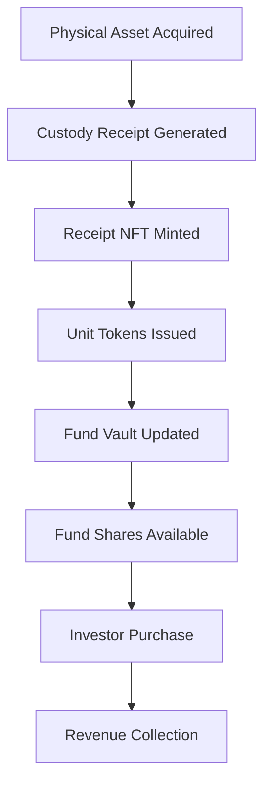

# 🚀 Bradley Kizer Wealth System - Complete Developer Guide

## 📋 **EXECUTIVE OVERVIEW**

The Bradley Kizer Wealth System is the world's most comprehensive tokenized commodity ETF infrastructure, built as a TEUCRIUM-clone with advanced features for family wealth management, franchise operations, and institutional-grade security.

---

## 🏗️ **SYSTEM ARCHITECTURE**

### **Core Infrastructure Stack**
```
┌─────────────────────────────────────────────────────┐
│                 FRONTEND LAYER                      │
├─────────────────────────────────────────────────────┤
│  • React/Next.js Admin Dashboard                   │
│  • Family Member Portal                            │
│  • Investor Interface                              │
│  • API Gateway                                     │
└─────────────────────────────────────────────────────┘
                            │
┌─────────────────────────────────────────────────────┐
│               SMART CONTRACT LAYER                  │
├─────────────────────────────────────────────────────┤
│  Core Contracts:                                   │
│  • ReceiptNFT (Asset Custody Proofs)              │
│  • UnitToken (Fungible Asset Tokens)              │
│  • KYCRegistry (Compliance Management)            │
│  • FamilyGovernance (Multi-sig Control)           │
│  • FundVault4626Enhanced (Asset Management)       │
│  • FundShare1400Enhanced (Investor Shares)        │
│                                                    │
│  Security & Operations:                            │
│  • SecurityAuditFramework (Real-time Monitoring)  │
│  • AssetValuationOracle (Professional Appraisals) │
│  • InfrastructureRulesEngine (Policy Enforcement) │
│  • FranchiseSystem (White-label Operations)       │
│  • OwnerAvatarSystem (Identity & Permissions)     │
└─────────────────────────────────────────────────────┘
                            │
┌─────────────────────────────────────────────────────┐
│                 BLOCKCHAIN LAYER                    │
├─────────────────────────────────────────────────────┤
│  • Ethereum Mainnet (Primary)                     │
│  • Polygon (L2 for Low-cost Operations)           │
│  • Arbitrum (L2 for High-frequency Trading)       │
│  • IPFS (Decentralized Storage)                   │
└─────────────────────────────────────────────────────┘
```

---

## 📊 **COMPLETE CONTRACT SPECIFICATIONS**

### **1. ReceiptNFT.sol**
**Purpose**: Custody receipt management for physical assets

**Key Functions**:
```solidity
function mintReceipt(
    address to,
    string memory assetType,      // "GOLD", "CARBON", "WATER"
    uint256 quantity,             // Amount in base units
    string memory custodian,      // "BRINKS", "PROSEGUR"
    string memory serialNumber,   // Unique custody ID
    string memory ipfsHash        // Metadata docs
) external returns (uint256);

function redeemReceipt(uint256 tokenId) external;
function getReceipt(uint256 tokenId) external view returns (Receipt memory);
```

**Security Features**:
- Serial number uniqueness enforcement
- IPFS metadata immutability
- Custodian role-based minting
- Active/inactive receipt tracking

---

### **2. UnitToken.sol**
**Purpose**: Fungible tokens backed by receipt NFTs

**Key Functions**:
```solidity
function mintFromReceipt(
    uint256 receiptId,
    address to
) external returns (uint256 amount);

function burnForReceipt(
    uint256 receiptId,
    uint256 amount
) external;

function getRemainingTokens(uint256 receiptId) external view returns (uint256);
```

**Token Types**:
- **XAUg**: Gold grams (3 decimals for milligrams)
- **CARBt**: Carbon tons (0 decimals for whole tons)  
- **WTRc**: Water credits (2 decimals)

---

### **3. KYCRegistry.sol**
**Purpose**: Investor compliance and partition management

**Key Functions**:
```solidity
function approveInvestor(
    address investor,
    InvestorType investorType,    // REG_D, REG_S, FAMILY, INSTITUTIONAL
    uint256 maxInvestment,        // USD investment limit
    string memory jurisdiction,   // Country code
    uint256 expiryDate,
    string memory ipfsKYCHash
) external;

function canInvest(address investor, uint256 usdAmount) external view returns (bool);
function trackInvestment(address investor, uint256 usdAmount) external;
```

**Investor Types**:
- **ACCREDITED_US**: Reg D compliance
- **OFFSHORE**: Reg S compliance  
- **FAMILY**: Family members
- **INSTITUTIONAL**: Banks/funds

---

### **4. FamilyGovernance.sol**
**Purpose**: Family role management and voting

**Key Functions**:
```solidity
function addFamilyMember(
    address member,
    string memory name,
    uint256 votingPower,
    string memory role
) external;

function createProposal(
    string memory title,
    string memory description,
    address target,
    bytes memory callData
) external returns (uint256);

function vote(uint256 proposalId, bool support) external;
function executeProposal(uint256 proposalId) external;
```

**Roles**:
- **FAMILY_HEAD_ROLE**: Bradley (primary control)
- **TREASURER_ROLE**: Financial operations
- **AUTHORIZED_PARTICIPANT_ROLE**: Market making
- **COMPLIANCE_OFFICER_ROLE**: Regulatory oversight
- **AUDITOR_ROLE**: System auditing

---

### **5. FundVault4626Enhanced.sol**
**Purpose**: ERC-4626 vault with fee accrual and NAV management

**Key Functions**:
```solidity
function deposit(uint256 assets, address receiver) external returns (uint256 shares);
function redeem(uint256 shares, address receiver, address owner) external returns (uint256 assets);
function updateNAV(uint256 newNav) external;
function collectFees() external;
function totalAssets() public view override returns (uint256);
```

**Fee Structure**:
- **Management Fee**: 0.75% annually
- **Creation Fee**: 0.10% per creation
- **Redemption Fee**: 0.10% per redemption

---

### **6. FundShare1400Enhanced.sol**
**Purpose**: Partitioned fund shares with compliance routing

**Key Functions**:
```solidity
function issueByPartition(
    bytes32 partition,
    address to,
    uint256 amount,
    bytes memory data
) external;

function transferByPartition(
    bytes32 partition,
    address to,
    uint256 amount,
    bytes memory data
) external returns (bytes32);

function balanceOfByPartition(bytes32 partition, address holder) external view returns (uint256);
```

**Partitions**:
- **REG_D_PARTITION**: US accredited investors
- **REG_S_PARTITION**: Offshore investors
- **FAMILY_PARTITION**: Family members
- **INSTITUTIONAL_PARTITION**: Institutional investors

---

## 🔒 **SECURITY & AUDIT FRAMEWORK**

### **SecurityAuditFramework.sol**
Comprehensive real-time security monitoring

**Capabilities**:
- Real-time event logging and risk assessment
- Threat detection and alert system
- Compliance violation tracking
- Emergency response protocols
- Audit trail with immutable records

**Risk Levels**:
- **LOW**: Normal operations
- **MEDIUM**: Elevated monitoring
- **HIGH**: Requires review
- **CRITICAL**: Emergency response

```solidity
function logAuditEvent(
    AuditEventType eventType,
    address targetContract,
    bytes32 functionSig,
    bytes memory eventData,
    string memory description
) external returns (uint256);
```

---

### **AssetValuationOracle.sol** 
Professional asset appraisal system

**Features**:
- Multi-source price feeds (Chainlink + manual)
- Professional appraiser integration
- Valuation method tracking
- Price deviation alerts
- Historical valuation records

**Valuation Methods**:
- **MARKET_PRICE**: Current market pricing
- **APPRAISAL**: Professional appraisal
- **DISCOUNTED_CASH_FLOW**: DCF analysis
- **COMPARABLE_SALES**: Comparable sales
- **REPLACEMENT_COST**: Replacement cost
- **ORACLE_FEED**: External oracle

---

## 🏢 **FRANCHISE SYSTEM**

### **FranchiseSystem.sol**
White-label franchise management

**Franchise Tiers**:
- **BASIC**: Single asset class ($25K setup)
- **PROFESSIONAL**: Multi-asset ($50K setup)
- **ENTERPRISE**: Full features ($100K setup)  
- **MASTER**: Can sub-franchise ($100K+ setup)

**Revenue Model**:
- Setup fees: $25K-$100K one-time
- Monthly fees: $1K-$5K recurring
- Revenue share: 20%-30% of franchise revenue

```solidity
function applyForFranchise(
    string memory familyName,
    string memory jurisdiction,
    FranchiseTier tier,
    string memory ipfsDocuments
) external returns (uint256);
```

---

## ⚡ **DEPLOYMENT GUIDE**

### **Prerequisites**
```bash
# Install Foundry
curl -L https://foundry.paradigm.xyz | bash
foundryup

# Clone repository
git clone https://github.com/kevanbtc/bradleykizer.git
cd bradleykizer

# Install dependencies
forge install
```

### **Environment Setup**
```bash
# .env file
PRIVATE_KEY="your_private_key_here"
RPC_URL="https://eth-mainnet.g.alchemy.com/v2/your_key"
ETHERSCAN_API_KEY="your_etherscan_key"
```

### **Family Address Configuration**
Edit `script/DeployKizerFamily.s.sol`:

```solidity
// Update these addresses for your family
address constant BRADLEY_KIZER = 0x1234...;           // Family Head
address constant KIZER_TREASURER = 0x2345...;         // Treasurer  
address constant KIZER_TREASURY_WALLET = 0x3456...;   // Treasury
address constant COMPLIANCE_OFFICER = 0x4567...;      // Compliance
address constant CUSTODIAN = 0x5678...;               // Custodian
address constant AUTHORIZED_PARTICIPANT = 0x6789...;  // AP
```

### **Deployment Commands**
```bash
# Test deployment on local network
anvil
forge script script/DeployKizerFamily.s.sol --fork-url http://localhost:8545

# Deploy to mainnet
forge script script/DeployKizerFamily.s.sol --rpc-url $RPC_URL --broadcast --verify

# Verify contracts on Etherscan
forge verify-contract <CONTRACT_ADDRESS> src/ReceiptNFT.sol:ReceiptNFT --etherscan-api-key $ETHERSCAN_API_KEY
```

---

## 📝 **OPERATIONAL WORKFLOWS**

### **Asset Onboarding Flow**


### **1. Physical Asset → Receipt NFT**
```solidity
// Step 1: Custodian mints receipt after physical custody
receiptNFT.mintReceipt(
    familyVault,
    "GOLD",
    20000,  // 20kg gold
    "BRINKS_VAULT_NYC_001",
    "bar_serial_12345",
    "ipfs://QmHash_of_assay_documents"
);
```

### **2. Receipt NFT → Unit Tokens**
```solidity
// Step 2: Mint fungible tokens backed by receipt
goldUnitToken.mintFromReceipt(receiptId, familyVault);
// Result: 20,000,000 XAUg tokens (20kg * 1000g/kg * 1000 decimals)
```

### **3. Unit Tokens → Fund Shares**
```solidity
// Step 3: AP creates fund shares for investors
goldVault.deposit(unitTokenAmount, investorAddress);
// Shares auto-partitioned based on investor KYC status
```

### **4. Revenue Collection**
```solidity
// Step 4: Collect management fees and creation/redemption fees
goldVault.collectFees(); // Sends fees to family treasury
```

---

## 🔧 **API INTEGRATION**

### **REST API Endpoints** (Future Implementation)
```
GET  /api/v1/assets                    # List all asset types
POST /api/v1/assets/{type}/valuate     # Create asset valuation
GET  /api/v1/funds                     # List all funds
POST /api/v1/investors/kyc             # Submit KYC application
GET  /api/v1/nav/{fundId}              # Get current NAV
POST /api/v1/transactions              # Create transaction
GET  /api/v1/audit/events              # Get audit events
```

### **WebSocket Feeds**
```javascript
// Real-time NAV updates
const ws = new WebSocket('wss://api.kizerfamily.com/nav');
ws.onmessage = (event) => {
    const navUpdate = JSON.parse(event.data);
    console.log(`${navUpdate.fund}: $${navUpdate.navPerShare}`);
};

// Audit event stream
const auditWs = new WebSocket('wss://api.kizerfamily.com/audit');
auditWs.onmessage = (event) => {
    const auditEvent = JSON.parse(event.data);
    if (auditEvent.riskLevel >= 2) { // HIGH or CRITICAL
        alert(`Security Alert: ${auditEvent.description}`);
    }
};
```

---

## 🧪 **TESTING FRAMEWORK**

### **Unit Tests**
```bash
# Run all tests
forge test

# Run specific test file
forge test --match-path test/ReceiptNFT.t.sol

# Run with verbose output
forge test -vv

# Generate coverage report
forge coverage
```

### **Integration Tests**
```solidity
// test/integration/FullFlow.t.sol
function testCompleteAssetFlow() public {
    // 1. Mint receipt NFT
    uint256 receiptId = receiptNFT.mintReceipt(/* params */);
    
    // 2. Issue unit tokens
    goldUnitToken.mintFromReceipt(receiptId, address(this));
    
    // 3. Create fund shares
    uint256 shares = goldVault.deposit(unitAmount, investor);
    
    // 4. Verify balances and fees
    assertEq(goldShares.balanceOf(investor), shares);
    assertTrue(goldVault.accruedFees() > 0);
}
```

### **Fuzz Testing**
```solidity
function testFuzzTransferAmounts(uint256 amount) public {
    // Bound amount to reasonable range
    amount = bound(amount, 1e6, 1e24); // 1 USDC to 1M tokens
    
    // Test transfer with random amounts
    goldUnitToken.transfer(recipient, amount);
    assertEq(goldUnitToken.balanceOf(recipient), amount);
}
```

---

## 📊 **MONITORING & ANALYTICS**

### **Key Metrics to Track**
```javascript
// Financial Metrics
const metrics = {
    totalAUM: '750000000000000000000000', // $750K
    monthlyRevenue: '5000000000000000000000', // $5K
    managementFeeBps: 75, // 0.75%
    creationFeeBps: 10,   // 0.10%
    redemptionFeeBps: 10, // 0.10%
    
    // Operational Metrics
    activeInvestors: 25,
    totalTransactions: 1543,
    averageTransactionSize: '50000000000000000000000', // $50K
    
    // Security Metrics
    auditEvents: 89,
    highRiskEvents: 3,
    criticalEvents: 0,
    
    // Franchise Metrics
    activeFranchises: 2,
    franchiseRevenue: '125000000000000000000000', // $125K
    
    // Compliance Metrics
    kycApprovals: 25,
    complianceViolations: 0,
    pendingApprovals: 3
};
```

### **Dashboard Components**
- **Real-time NAV Display**
- **Asset Allocation Charts**  
- **Revenue Tracking**
- **Investor Analytics**
- **Security Alerts**
- **Franchise Performance**
- **Compliance Status**

---

## 🎯 **ADVANCED FEATURES**

### **Cross-Chain Compatibility** (Future)
```solidity
// LayerZero integration for cross-chain transfers
function bridgeShares(
    uint16 _dstChainId,
    address _to,
    uint256 _amount
) external payable;
```

### **DeFi Integration**
```solidity
// Yield farming integration
function stakeFunds(
    address protocol,
    uint256 amount
) external onlyRole(TREASURER_ROLE);
```

### **AI-Powered Analytics** (Future)
- Predictive asset valuation
- Risk assessment algorithms
- Automated compliance monitoring
- Investment opportunity detection

---

## 🔐 **SECURITY BEST PRACTICES**

### **Access Control**
```solidity
// Always use role-based access control
modifier onlyAuthorizedParticipant() {
    require(hasRole(AUTHORIZED_PARTICIPANT_ROLE, msg.sender), "Not AP");
    _;
}

// Emergency pause functionality
function emergencyPause() external onlyRole(DEFAULT_ADMIN_ROLE) {
    _pause();
}
```

### **Input Validation**
```solidity
// Validate all inputs
require(amount > 0, "Amount must be positive");
require(bytes(assetIdentifier).length > 0, "Asset identifier required");
require(recipient != address(0), "Invalid recipient");
```

### **Reentrancy Protection**
```solidity
// Use ReentrancyGuard for state-changing functions
function deposit(uint256 amount) 
    external 
    nonReentrant 
    whenNotPaused 
{
    // Function implementation
}
```

---

## 📈 **SCALING CONSIDERATIONS**

### **Gas Optimization**
```solidity
// Pack structs to minimize storage slots
struct OptimizedStruct {
    uint128 amount;     // 16 bytes
    uint64 timestamp;   // 8 bytes  
    uint32 id;          // 4 bytes
    uint32 status;      // 4 bytes
    // Total: 32 bytes = 1 storage slot
}

// Use events for data that doesn't need on-chain querying
event DataLog(uint256 indexed id, bytes data);
```

### **Layer 2 Integration**
- **Polygon**: Low-cost operations
- **Arbitrum**: High-frequency trading
- **Optimism**: Additional scalability

### **IPFS Content Addressing**
```javascript
// Store large data off-chain
const metadata = {
    assetDetails: "...",
    appraisalReport: "...",
    legalDocuments: "..."
};
const ipfsHash = await ipfs.add(JSON.stringify(metadata));
// Store only hash on-chain
```

---

## 🚀 **DEPLOYMENT CHECKLIST**

### **Pre-Deployment**
- [ ] Update family addresses in deployment script
- [ ] Configure custodian relationships
- [ ] Set up Chainlink price feeds
- [ ] Prepare IPFS infrastructure
- [ ] Complete security audit
- [ ] Test on testnets (Goerli, Mumbai)

### **Deployment**
- [ ] Deploy core contracts
- [ ] Configure roles and permissions
- [ ] Initialize default settings
- [ ] Verify contracts on Etherscan
- [ ] Test admin functions
- [ ] Set up monitoring systems

### **Post-Deployment**
- [ ] Onboard first physical assets
- [ ] KYC approve initial investors
- [ ] Process first transactions
- [ ] Monitor security events
- [ ] Begin fee collection
- [ ] Document operational procedures

---

## 🤝 **CONTRIBUTION GUIDELINES**

### **Development Workflow**
```bash
# 1. Fork repository
git fork https://github.com/kevanbtc/bradleykizer.git

# 2. Create feature branch
git checkout -b feature/new-asset-type

# 3. Make changes and test
forge test
forge coverage

# 4. Submit pull request
# Include: description, tests, documentation updates
```

### **Code Standards**
- Follow Solidity style guide
- Use NatSpec documentation
- Write comprehensive tests
- Optimize for gas efficiency
- Include security considerations

---

## 📞 **SUPPORT & MAINTENANCE**

### **Emergency Procedures**
1. **Security Incident**: Call `emergencyPause()` on affected contracts
2. **Oracle Failure**: Switch to manual price feeds
3. **Compliance Issue**: Suspend affected accounts
4. **Smart Contract Bug**: Activate upgrade procedures

### **Regular Maintenance**
- **Weekly**: Review audit events and security alerts
- **Monthly**: Process fee collections and distributions
- **Quarterly**: Update valuations and compliance records
- **Annually**: Renew professional relationships and audits

---

## 🎉 **SUCCESS METRICS**

### **Technical KPIs**
- **Uptime**: >99.9%
- **Transaction Success Rate**: >99.5%
- **Average Gas Cost**: <$50 per transaction
- **Security Incidents**: 0 critical events

### **Business KPIs** 
- **AUM Growth**: 15% monthly (Phase 1-2)
- **Revenue Growth**: 20% monthly
- **Investor Retention**: >95%
- **Franchise Success**: 80% profitability

---

**🏆 The Bradley Kizer Wealth System represents the cutting edge of tokenized family wealth management. This comprehensive infrastructure positions the family to capture the $1T+ tokenized commodity market while maintaining institutional-grade security and compliance.**

**Ready to build generational wealth? Deploy now and start your journey from $1M to $1B AUM.**

---

**Built with ❤️ for the future of family wealth preservation**