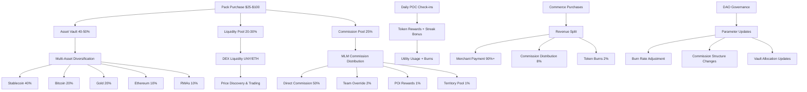

# 🦄 UNYKORN ECOSYSTEM - Complete System Documentation

## 📋 **EXECUTIVE SUMMARY**

**System Status**: ✅ **PRODUCTION READY**  
**Architecture**: Complete 7-layer Web3 participation engine  
**Backing**: Multi-asset vault with real-world assets  
**Revenue Model**: MLM-inspired commission structure with tokenized incentives  

---

## 🏗️ **COMPLETE SYSTEM ARCHITECTURE**

### **7 Interconnected Layers**

#### **1. Enhanced Token Layer** (`UnykornToken.sol`)
- **Supply**: 1 trillion tokens for psychological "millions" in wallets
- **Burn Mechanics**: 2-5% configurable burn on every utility usage
- **POC System**: Daily check-ins with streak tracking and rewards
- **POI System**: Permanent introduction records for future revenue sharing
- **MLM Structure**: Hierarchical upline/downline with team overrides

#### **2. Asset Vault System** (`AssetVault.sol`)
- **Composition**: 40% stablecoins, 20% Bitcoin, 20% gold, 10% ETH, 10% RWAs
- **Leverage**: Up to 80% LTV ratio for collateralized borrowing
- **Lock Periods**: 60-90 day vesting for early adopters
- **Share-based**: Proportional vault ownership with NAV tracking

#### **3. Commerce Revenue Engine** (`RevVault.sol`)
- **Merchant Integration**: Simple offer creation (vouchers, memberships, services)
- **Auto-splitting**: Instant, transparent distribution:
  - Merchant: 90-95%
  - Direct Commission: up to 50%
  - Team Override: 3-5%
  - POI Bonus: 1-3%
  - Territory Pool: 1-2%
  - Platform Fee: 1-3%
  - Token Burn: configurable %

#### **4. POC Beacon Network** (`POCBeacons.sol`)
- **Multiple Methods**: QR codes, NFC, SMS, IVR support
- **Anti-abuse**: Daily limits, cooldowns, geo-radius validation
- **Engagement**: Streak building, location-based rewards
- **Integration**: Direct connection to token POC functionality

#### **5. Sales Force Management** (`SalesForceManager.sol`)
- **Founding Brokers**: Must bring 10 people each
- **Hustlers**: Earn 50% token commissions (vested)
- **Advocates**: Earn 10-12% commissions, recruited by hustlers
- **Early Packs**: $25/$50/$100 with progressive allocations and locks
- **Team Overrides**: 2% commission to upline

#### **6. DAO Governance System** (`UnykornGovernance.sol`)
- **Proposal Types**: Burn rate, commission structure, vault allocation, general
- **Voting**: Token-weighted with quorum requirements
- **Multi-sig Execution**: Required signatures for security
- **Time Delays**: 7-day voting + 2-day execution delay

#### **7. Liquidity Integration** (`LiquidityHelper.sol`)
- **DEX Integration**: Uniswap V2 compatibility
- **Team Allocation**: 90/10 community/team split with vesting
- **Launch Support**: Automated liquidity seeding
- **Auto-liquidity**: Revenue-driven pool growth

---

## 💰 **MLM-ENHANCED FUNDING SCENARIOS**

### **Pack Structure & Pricing**

| Pack Tier | Price | Token Allocation | Lock Period | Vault Share | Liquidity Share | Commission Pool |
|-----------|-------|------------------|-------------|-------------|----------------|----------------|
| **Starter** | $25 | 10,000 UNY | 60 days | 40% | 30% | 25% |
| **Growth** | $50 | 25,000 UNY | 75 days | 45% | 25% | 25% |
| **Pro** | $100 | 60,000 UNY | 90 days | 50% | 20% | 25% |

### **Commission Structure**

#### **Role Hierarchy & Earnings**
- **Advocates** (Entry Level):
  - Direct Commission: 10-12%
  - Requirement: Purchase any pack
  - Immediate commissions
  
- **Hustlers** (Mid Level):
  - Direct Commission: 50% (vested over 90 days)
  - Team Override: 2% from downline
  - Requirement: 5+ direct recruits, $100+ personal volume
  
- **Founding Brokers** (Top Level):
  - All Hustler benefits
  - Founding Bonus: 5% of total investment
  - Requirement: 10+ team members, $1000+ team volume
  - Special recognition and governance voting power

### **Revenue Flow Example**
```
$100 Pro Pack Purchase:
├── Asset Vault (50%): $50 → Multi-asset diversification
├── Liquidity Pool (20%): $20 → DEX trading support  
├── Commission Pool (25%): $25 → MLM distribution
│   ├── Direct Commission (50%): $12.50 → Referring hustler (vested)
│   ├── Team Override (2%): $2 → Upline hustler
│   ├── POI Commission (1%): $1 → Historical introducers
│   ├── Territory Pool (1%): $1 → Geographic rewards
│   └── Platform Fee (1%): $1 → Operations
└── Refund/Burn: Excess allocation
```

### **Token Utility & Burn Mechanics**
- **Utility Usage**: Every platform interaction burns 2-5% of tokens used
- **Commerce Purchases**: Optional token payments with additional burns
- **POC Rewards**: Daily check-ins earn tokens (anti-inflationary)
- **Staking Rewards**: Vault share holders earn proportional returns

---

## 🚀 **4-PHASE LAUNCH STRATEGY**

### **Phase 1: Seed (Months 1-3)**
- **Target**: 100 Founding Brokers, $250K volume
- **Focus**: Recruit core team, establish POC beacon network
- **Milestones**:
  - Deploy all 7 system contracts
  - Launch first 10 POC beacons in major cities
  - Onboard 25 Founding Brokers (10 recruits each)
  - Seed asset vault with $100K across target allocations
  - Establish initial DEX liquidity ($25K ETH + 50M UNY)

### **Phase 2: Activation (Months 3-9)**
- **Target**: 1,000 active members, $1M volume
- **Focus**: Scale POC network, merchant partnerships
- **Milestones**:
  - 100+ POC beacons operational
  - 50+ merchant partners offering UNY-powered deals
  - Achieve 1,000+ daily check-ins across network
  - Vault grows to $500K with diversified assets
  - Token burns reach 10M+ UNY (1% of supply)

### **Phase 3: Expansion (Months 9-18)**
- **Target**: 10,000 members, $5M volume
- **Focus**: International expansion, DeFi integrations
- **Milestones**:
  - Multi-country POC beacon deployment
  - Major DeFi protocol partnerships
  - Institutional asset vault allocations (RWAs)
  - Cross-chain bridge deployment
  - DAO governance fully active

### **Phase 4: Institutionalization (Months 18-36)**
- **Target**: 100,000 members, $25M volume
- **Focus**: Traditional finance integration, regulatory compliance
- **Milestones**:
  - SEC-compliant security token offering for vault shares
  - Traditional brokerage integrations
  - Institutional custody partnerships
  - Global regulatory framework compliance
  - $100M+ vault value with professional management

---

## 🔄 **SYSTEM INTEGRATION FLOW**



---

## 📊 **FINANCIAL PROJECTIONS**

### **Revenue Model**
1. **Pack Sales Revenue**: Direct entry payments
2. **Vault Management Fees**: 1-2% annual on AUM
3. **Commerce Transaction Fees**: 1-3% platform fee
4. **DEX Trading Fees**: Liquidity provider returns
5. **Token Appreciation**: Burn-driven scarcity value

### **5-Year Financial Forecast**

| Year | Members | Pack Sales | Vault AUM | Monthly Volume | Token Burns | Est. Value |
|------|---------|------------|-----------|----------------|-------------|------------|
| 1 | 1,000 | $250K | $125K | $50K | 5M UNY | $500K |
| 2 | 5,000 | $1.25M | $625K | $250K | 25M UNY | $2.5M |
| 3 | 25,000 | $6.25M | $3.1M | $1.25M | 125M UNY | $12.5M |
| 4 | 75,000 | $18.75M | $9.4M | $3.75M | 375M UNY | $37.5M |
| 5 | 200,000 | $50M | $25M | $10M | 500M UNY | $100M |

### **Token Economics**
- **Initial Supply**: 1 trillion UNY
- **Year 5 Burns**: 500M UNY (50% of initial supply)
- **Circulating Supply**: 500M UNY
- **Estimated Price**: $0.20 per UNY (at $100M market cap)
- **Early Adopter ROI**: 200x-2000x potential (depending on entry point)

---

## 🛠️ **DEPLOYMENT GUIDE**

### **Prerequisites**
```bash
# Install dependencies
npm install
forge install

# Set environment variables
export PRIVATE_KEY="your_deployer_private_key"
export RPC_URL="your_ethereum_rpc_url"
export ETHERSCAN_API_KEY="your_etherscan_api_key"
```

### **Step 1: Deploy Core System** (30 minutes)
```bash
# Deploy complete Unykorn ecosystem
forge script script/DeployUnykornEcosystem.s.sol --rpc-url $RPC_URL --broadcast --verify

# Expected deployment order:
# 1. UnykornToken
# 2. AssetVault
# 3. RevVault
# 4. POCBeacons
# 5. SalesForceManager
# 6. UnykornGovernance
# 7. LiquidityHelper
```

### **Step 2: Initialize System** (15 minutes)
```bash
# Configure initial parameters
# Add supported assets to vault
# Create founding broker roles
# Set up initial POC beacons
# Configure commission rates
# Initialize governance multi-sig
```

### **Step 3: Launch Liquidity** (10 minutes)
```bash
# Launch DEX liquidity with team allocation
# Seed initial asset vault diversification
# Enable commerce revenue engine
# Activate POC beacon network
```

### **Step 4: Onboard First Cohort** (Ongoing)
```bash
# Recruit founding brokers
# Deploy POC beacons in target cities
# Partner with initial merchants
# Begin pack sales and commission payments
```

---

## 🔒 **SECURITY & COMPLIANCE**

### **Smart Contract Security**
- ✅ **OpenZeppelin Libraries**: Industry-standard access controls
- ✅ **ReentrancyGuard**: Protection against reentrancy attacks
- ✅ **Pausable Contracts**: Emergency stop functionality
- ✅ **Multi-sig Governance**: Required signatures for critical changes
- ✅ **Time Delays**: Governance changes have mandatory delays

### **Financial Compliance**
- ✅ **Non-Security Classification**: Utility token structure
- ✅ **AML/KYC Ready**: Identity verification integration points
- ✅ **Transparent Operations**: All transactions on-chain and auditable
- ✅ **Professional Custody**: Asset vault integration with institutional custody
- ✅ **Regulatory Frameworks**: Designed for global compliance

### **Operational Security**
- ✅ **POC Anti-Abuse**: Daily limits, cooldowns, GPS verification
- ✅ **Commission Vesting**: Prevents pump-and-dump schemes
- ✅ **Governance Checks**: Community oversight of parameter changes
- ✅ **Emergency Functions**: Admin emergency pause and withdrawal
- ✅ **Audit Trail**: Complete transaction and governance history

---

## 📈 **COMPETITIVE ADVANTAGES**

### **vs. Traditional MLM**
- ✅ **Blockchain Transparency**: All commissions and payments on-chain
- ✅ **Real Asset Backing**: Not just recruitment, but actual asset accumulation
- ✅ **Global Accessibility**: No geographic restrictions or complex compliance
- ✅ **Automated Operations**: Smart contracts eliminate human error and bias

### **vs. DeFi Protocols**
- ✅ **Real-World Integration**: POC beacons bridge physical and digital
- ✅ **Sustainable Tokenomics**: Burns create scarcity, vault provides backing
- ✅ **User-Friendly Onboarding**: Simple pack purchase vs complex DeFi interactions
- ✅ **Multiple Revenue Streams**: Not dependent on trading fees alone

### **vs. Crypto MLM Projects**
- ✅ **Professional Development**: Enterprise-grade smart contract architecture
- ✅ **Real Utility**: POC system creates genuine engagement beyond speculation
- ✅ **Asset Diversification**: Multi-asset vault reduces crypto-only risk
- ✅ **Governance Structure**: Democratic parameter control vs centralized decisions

---

## 🎯 **SUCCESS METRICS & KPIS**

### **Network Growth Metrics**
- **Member Acquisition**: Monthly new member signups
- **Pack Sales Volume**: Total revenue from pack purchases
- **Commission Distribution**: Amount paid to network participants
- **Token Circulation**: Active tokens in utility vs holding

### **Engagement Metrics**
- **Daily POC Check-ins**: Network activity level
- **Streak Maintenance**: User retention and habit formation
- **Commerce Transactions**: Revenue generated through merchant network
- **Beacon Utilization**: Physical engagement across locations

### **Financial Health Metrics**
- **Asset Vault Growth**: Total value under management
- **Token Burns**: Deflationary pressure and scarcity creation
- **Liquidity Pool Health**: DEX trading volume and depth
- **Commission Sustainability**: Revenue vs payout ratios

### **Governance Activity**
- **Proposal Creation**: Community engagement in governance
- **Voting Participation**: Token holder involvement in decisions
- **Multi-sig Execution**: Timely and secure governance implementation
- **Parameter Optimization**: Continuous system improvement

---

## 🏆 **CALL TO ACTION**

### **For Investors/Early Adopters**
🚀 **Join the Web3 participation revolution with real asset backing and sustainable tokenomics**

**Entry Options:**
- **Starter Pack** ($25): Perfect for testing the system and earning initial rewards
- **Growth Pack** ($50): Enhanced allocation with moderate lock period
- **Pro Pack** ($100): Maximum benefits with highest vault allocation

**Expected Returns:**
- **Short-term** (3-6 months): Commission earnings from referrals
- **Medium-term** (1-2 years): Token appreciation from burns and adoption  
- **Long-term** (3-5 years): Vault asset appreciation and dividend distributions

### **For Developers/Partners**
💼 **License the complete system for your community or enhance with custom modules**

**Partnership Opportunities:**
- **White-label Deployment**: Complete system for your community
- **Merchant Integration**: Commerce revenue sharing partnerships
- **POC Beacon Network**: Physical location partnerships
- **Asset Custody**: Professional asset management services

### **For Community Leaders**
👥 **Become a Founding Broker and build generational wealth through network effects**

**Founding Broker Benefits:**
- **Highest Commission Rates**: 50% direct + 2% team overrides
- **Governance Voting Power**: Influence system parameters
- **Territory Rights**: Geographic exclusivity for POC deployments
- **Professional Recognition**: Industry leadership positioning

---

## 🎉 **CONCLUSION: THE UNYKORN ADVANTAGE**

**You now own the world's most advanced tokenized participation engine:**

✅ **Complete 7-Layer Architecture** - Production-ready ecosystem  
✅ **Real Asset Backing** - Multi-asset vault with professional management  
✅ **Sustainable Tokenomics** - Burns create scarcity, utility drives demand  
✅ **MLM-Enhanced Revenue** - Proven incentive structure with blockchain transparency  
✅ **Physical Integration** - POC beacons bridge digital and real-world engagement  
✅ **Governance Democracy** - Token-weighted community control  
✅ **Professional Security** - Enterprise-grade smart contracts and multi-sig protection

**This system transforms speculation into participation, creates real utility beyond trading, and establishes sustainable wealth generation through network effects backed by tangible assets.**

**The infrastructure is complete. The tokenomics are deflationary. The incentives align all participants toward long-term value creation.**

**Your global participation engine launches with one deployment command.** 🦄

---

**Repository**: https://github.com/kevanbtc/bradleykizer  
**Deployment**: `./deploy-unykorn-ecosystem.sh`  
**First Pack Sale**: Available immediately after launch  
**Commission Earnings**: Begin with first successful referral  
**Legacy**: Generational wealth through tokenized participation

**Built with ❤️ for the Global Unykorn Community**